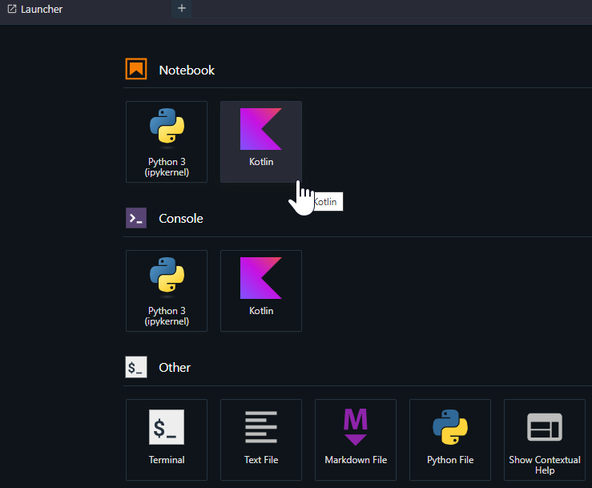

## Kotlin Courses from Coursera

### Courses

- [Programming Fundamental in Kotlin](https://www.coursera.org/learn/meta-programming-fundamentals-kotlin)
    - **Notebook**

- [Advanced Programming in Kotlin](https://www.coursera.org/learn/advanced-programming-in-kotlin)
    - **Notebook**

### Jupyter Notebook Setup

Install [Kotlin Kernel for Jupyter notebooks (kotlin-jupyter-kernel)](https://github.com/Kotlin/kotlin-jupyter), and start the Jupyter Lab. It can be accessed on *http://localhost:8888*.

```bash
python -m venv venv
source venv/bin/activate
pip install -r requirements-dev.txt
JUPYTER_ENABLE_LAB=yes jupyter lab --ServerApp.token='' --ServerApp.password=''
```

On the *Launcher* tab, select the `Kotlin` kernel.

